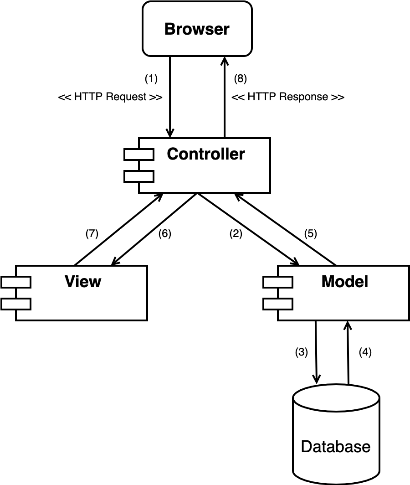

# Training Backend

## Purpose

* Understanding the components of HTTP Request and HTTP Response
* Knowing how to use different types of HTTP Request and HTTP Response
* Building a full basic functionality Web Server

## Require

* Object-oriented programming skills with `Python`
* Library management with `Pip`
* Basic knowledge of `MongoDB` database and `PyMongo` library

## Theory

*Reference: [HTTP](https://developer.mozilla.org/en-US/docs/Web/HTTP)*

### MVC Architecture

MVC is an architectural pattern which means it rules the whole architecture of the applications.

[//]: # (![MVC Architecture]&#40;images/mvc.png&#41;)

    

* Models: Contains all the objects that describe the data such as classes, data processing methods, and is responsible for accessing data on the database.
* Views: A collection of user interface files.
* Controllers: Keeping the task of handling user requests, Controllers will call Models to manipulate the database and return the user interface through Views.

> *Task 1: Descript MVC model operation flow*

*Reference: [Đôi điều về mô hình MVC](https://viblo.asia/p/doi-dieu-ve-mo-hinh-mvc-E375z0vJZGW)*

### HTTP Request

[//]: # (![HTTP Request]&#40;images/http_request.png&#41;)

    

Requests consist of the following elements:

* `HTTP method`: Usually a verb like GET, POST, or a noun like OPTIONS or HEAD that defines the operation the client wants to perform. Typically, a client wants to fetch a resource (using GET) or post the value of an HTML form (using POST), though more operations may be needed in other cases.
* `Path`: The path of the resource to fetch; the URL of the resource stripped from elements that are obvious from the context, for example without the protocol (http://), the domain (here, developer.mozilla.org), or the TCP port (here, 80).
* `Version`: The version of the HTTP protocol.
* `Headers`: That convey additional information for the servers.
* `Body`: (optional) For some methods like POST, which contain the resource sent.

> *Task 2: List HTTP methods and their usage*

*Reference: [Requests](https://developer.mozilla.org/en-US/docs/Web/HTTP/Overview#requests)*

### HTTP Response

[//]: # (![HTTP Response]&#40;images/http_response.png&#41;)

    

Responses consist of the following elements:

* `Version`: The version of the HTTP protocol they follow.
* `Status Code`: Indicating if the request was successful or not, and why.
* `Status Message`: A non-authoritative short description of the status code.
* `Headers`: Like those for requests.
* `Body`: (optional) Containing the fetched resource.

> *Task 3: List HTTP response status codes and their meanings*

*Reference: [Responses](https://developer.mozilla.org/en-US/docs/Web/HTTP/Overview#responses)*

### RESTful API with CRUD

| Action                 | Method | Path           |
|------------------------|--------|----------------|
| Get all entities       | GET    | /entities      |
| Create an entity       | POST   | /entities      |
| Get an entity by ID    | GET    | /entities/{id} |
| Update an entity by ID | PUT    | /entities/{id} |
| Delete an entity by ID | DELETE | /entities/{id} |

*Reference: [RESTful API là gì ?](https://viblo.asia/p/restful-api-la-gi-1Je5EDJ4lnL)*

## Practice

