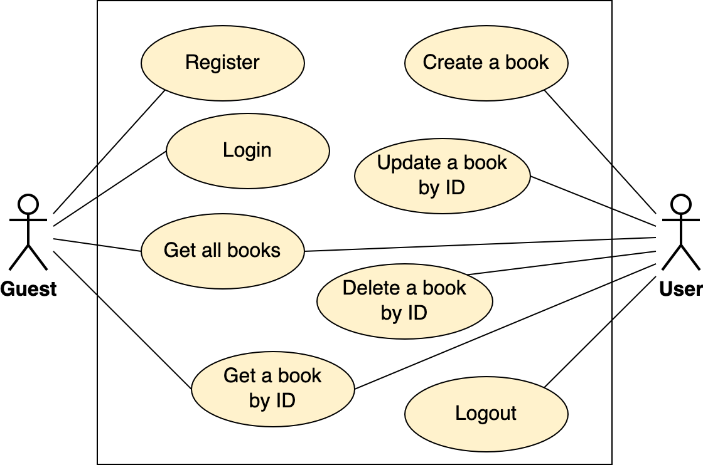

# Practice

## Description

A simple Web Server to build a Book Archive. 
Users can add any books to the archive and manage their books, by updating and deleting. 
And everyone can view all books in the archive.

<p align="center">
    
</p>

## Setup

Copy file `.env.example` to `.env` and change the following lines according to database settings:
```
MONGO_HOST=0.0.0.0
MONGO_PORT=27017
MONGO_USERNAME=admin
MONGO_PASSWORD=admin123
MONGO_DATABASE=example_db
```

Install dependencies:
* (Optional) Create virtual environment `venv`
```
$ python3 -m venv venv
$ source venv/bin/activate
```
* Install requirement libraries
```
$ pip3 install -r requirements.txt
```

## Framework Sanic

*Reference: [Introduction | Sanic Framework](https://sanic.dev/en/guide/)*

* Web Server: [main.py](main.py)
* Configs: [config.py](config.py)
* Example APIs: [books_blueprint.py](app/apis/books_blueprint.py)

> Task 1: 
> 
> * Run Web Server
> ```
> $ python3 main.py
> ```
> * Call APIs via browser and [Postman](https://www.postman.com/downloads/)
> ```
> GET localhost:8080
> GET localhost:8080/books
> ```

## Database

*Reference: [1.Databases](../../1.Databases)*

* Use `MongoDB` database and `PyMongo` library
* Database design: [collections](../docs/database_models/collections.json)
* Functions to query and update data: [mongodb.py](app/databases/mongodb.py)

> Task 2:
> 
> * Write functions to `create`, `get`, `update` and `delete` a book

## RESTful API

*Reference: [RESTful API](../README.md#restful-api-with-crud)*

* API Get all books: `GET /books`
* Validate HTTP request body: [json_validator.py](app/decorators/json_validator.py)

> Task 3:
> 
> * Complete CRUD books APIs
> 
> ```
> Create a book:        POST    /books
> 
> Read a book by ID:    GET     /books/{id}
> 
> Update a book by ID:  PUT     /books/{id}
> 
> Delete a book by ID:  DELETE  /books/{id}
> ```

## Caching

*Reference: [Cache strategies](https://docs.aws.amazon.com/AmazonElastiCache/latest/mem-ug/Strategies.html)*

* Use `Redis` in-memory data store
* Functions to set and get cache: [redis_cached.py](app/databases/redis_cached.py)
* Time-to-live

> Task 4:
> 
> * API Get all books: Cache data response

[//]: # (> * API Create, Update, Delete: Update cache when data updated)

## Authentication & Authorization

*Reference: [JSON Web Tokens](https://auth0.com/learn/json-web-tokens/)*

* Use JSON Web Token `JWT`
* Generate JWT: [jwt_utils.py](app/utils/jwt_utils.py)
* Authenticate: [auth.py](app/decorators/auth.py)
* Authorization: Check if the user has permission to take

[//]: # (![JWT]&#40;../docs/images/jwt.png&#41;)

<p align="center">
    
</p>

> Task 5:
> 
> * Write API Register and API Login
> * API Create a book: Must be logged in
> * API Update, Delete: Only owner are taken

## Unittest

*Reference: [Unit Test a REST API](https://www.testim.io/blog/unit-test-rest-api/)*

* Automatic API testing
* Unittest for books APIs: [testing.py](testing.py)

> Task 6:
> 
> * Complete unittest for all APIs
> * Run unittest
> ```
> $ python3 testing.py
> ```
